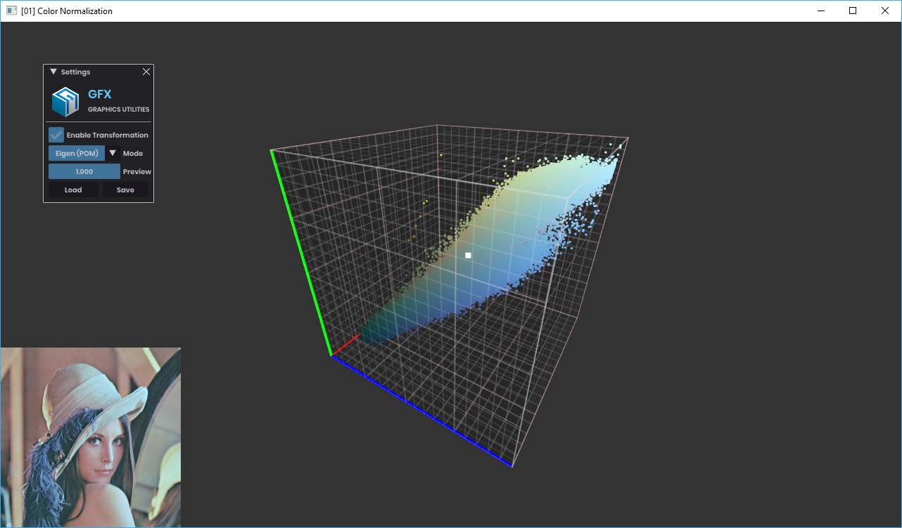

# Color Normalization

This application uses principal axis transformations to normalize the colors of any given image to a gray average. Additionally, I added a nice visualization for the colors.

