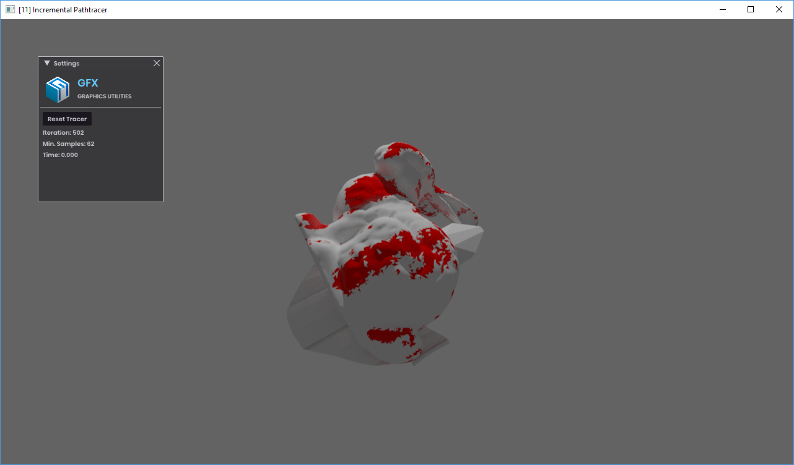

# Incremental Pathtracer

This is a pathtracer that works in a manner where every thread will always be working (or at least I think so).
This means on each draw call, the currently scheduled rays for each pixel are traversed. After that, if the ray has bounces left, the next one will replace the current one, otherwise a new one is generated.

